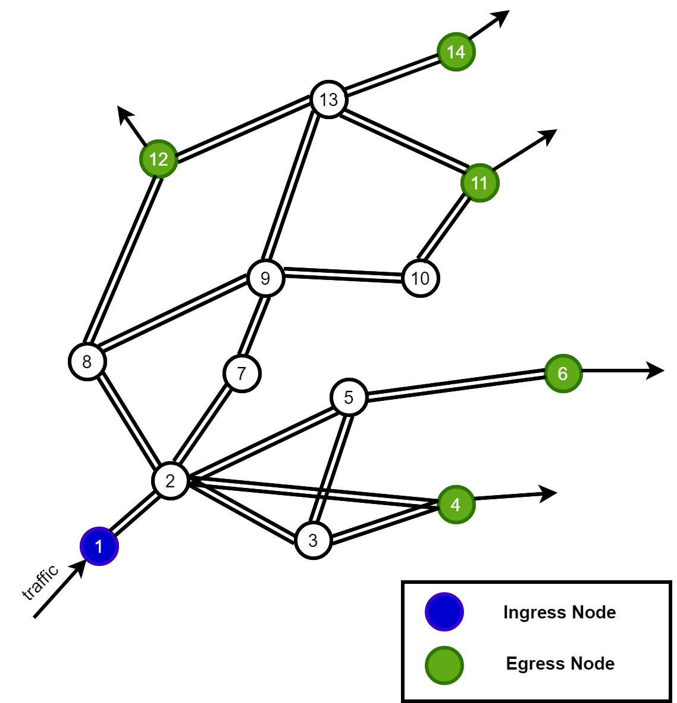
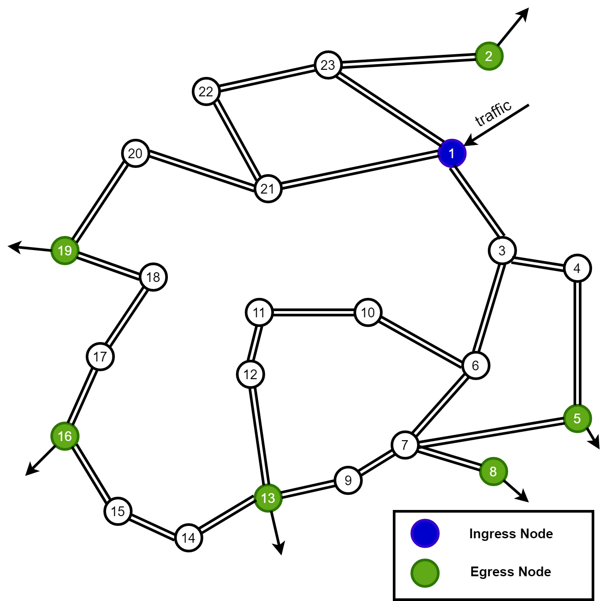

# Introduction

This project represents the work in our paper submmitted to IEEE International Conference on Communications 2021 **"A Reinforcement Learning-Based Solution for Intra-Domain Egress Selection"** - DOI: [10.1109/HPSR52026.2021.9481846](https://doi.org/10.1109/HPSR52026.2021.9481846) - Authors: **Duc-Huy LE, Hai Anh TRAN, Sami SOUIHI**

In this project, we provide:
- SDN application source codes
- Our Testbed configurations and scripts

# Dependencies

## Ryu controller
We use [Ryu](https://ryu-sdn.org) to deploy our SDN application. Ryu can work in any OS Environment that support python 2 (Our application and experiements are performed in Ubuntu 18.04). You can install ryu using pip:

```bash
% pip install ryu
```
or building from source code as follows:
```bash
% git clone git://github.com/osrg/ryu.git 
% cd ryu; python ./setup.py install 
```

## Mininet
To simulate an SDN network, we use the popular framework [Mininet](http://mininet.org/). Mininet currenttly only works in Linux. In our project, we run mininet in an Ubuntu LTS 18.04 VM. To get mininet, you can simply download a compressed Mininet VM from [Mininet downloadpage](https://github.com/mininet/mininet/wiki/Mininet-VM-Images) or install through apt:

```bash
sudo apt update
sudo apt install mininet
```

or install natively from source:
```bash
git clone git://github.com/mininet/mininet
cd mininet
git tag  # list available versions
git checkout -b cs244-spring-2012-final  # or whatever version you wish to install
util/install.sh -a
```

## Testbed auxiliary components

In our custom testbed, to generate traffic in our simulated network, we use **tcpreplay** to emulate packets from network capture files (.pcap). Before that, we use several components(**tcprewrite**, **bittwiste**, **editcap**, **mergecap**) to modify the files so that they can fit the hosts's identity (e.g. IP Addresses). The pcap files are transmitted through virtual hosts in the mininet simulation environment. The details on how traffic was generated can be found in our [previous work](https://github.com/duchuyle108/SDN-TMprediction). Other than that, we used **netem** to create delay and loss in specific network ports so that we could simulate different conditions in network links.

## Reinforcement Learning module
For the Multi-Armed Bandit problem, we used four algorthims ($\epsilon$-greedy, softmax, UCB1 & SP-UCB2), pseudo codes of which can be found in our paper. The algorithms were translated in python and implemented in our problem solving task.

## Files
1. ryu-apps/mab.py: Our MAB algorithm implementation in python. 
2. ryu-apps/routing.py: A ryu application which monitors changes in network, updates routing table and installs shortest path routing scheme for SDN switches. Main purpose of this application is to route traffic flows between nodes in the network.
3. ryu-apps/enode_select.py: The main ryu application that executes the our main task by periodically chooses new egress point and records experimental scores.
4. testbed/mininet/bso.py: The python script to create BSO network topology (SDN switches, hosts and links) in mininet enviroment.
5. testbed/mininet/funet.py: The python script to create Funet topology (SDN switches, hosts and links) in mininet enviroment.
6. exp-results: our results that recorded by the *enode_select.py* app above

# Testbed deployment

## Ryu applications

We used following command to run the applications:

```bash
ryu-manager --observe-links routing.py enode_select.py
```

Option **observe-links** enables network discovery mode, which requires the controller to periodically send LLDP packets to every port of every switches and hence help it frequently update network topology information (e.g. a new switch connects).

## Network simulation
We use two network topology for the tasks, which is illustrated as follows:

<p align="center">
  
</p>

<div class="caption" align="center"> BSO Network (left) and Funet (right) Topology </div>

To employ the network in mininet we simply ran:

```bash
python bso.py
```
or
```bash
python funet.py
```
depending on which topology we wanted to experiment.

After running the script, the topology will be created and we could manually access to the hosts in the network via mininet CLI to replay network activities using **tcpreplay** in each host. Additionally, this process could be automated by adding command to each host in the python script of each network. When the network is created, in the host machine of mininet, there are multiple virtual network interfaces created corresponding to each port of hosts and switches in the network. Therefore, to simulate delay and loss in particular links, we use **netem** to cause loss and delay to their interfaces in the host machine. To initiate netem in an interface, we might used
```bash
sudo tc qdisc add dev sw1-eth2 root netem loss 2% delay 10ms 2ms 25%
```
In this case, the interface *sw1-eth2* will have loss rate at 2% and delayed for 10 $\pm$ 2 ms with correlation as 25%.

To change a netem configuration in an interface we might use

```bash
sudo tc qdisc change dev sw1-eth2 root netem loss 2% delay 10ms 2ms 25%
```

And to remove all rules in an interface, we can use
```bash
sudo tc qdisc del dev sw1-eth2 root
```

With these commands, we were able to create scripts to automate our network changes overtime. More usage of netem could be found at its [man page](https://man7.org/linux/man-pages/man8/tc-netem.8.html).

# Experimental result

The detailed result for our experiments could be found in the paper.

# Acknowledment

This research is funded by Vietnam National Foundation for Science and Technology Development (NAFOSTED).
